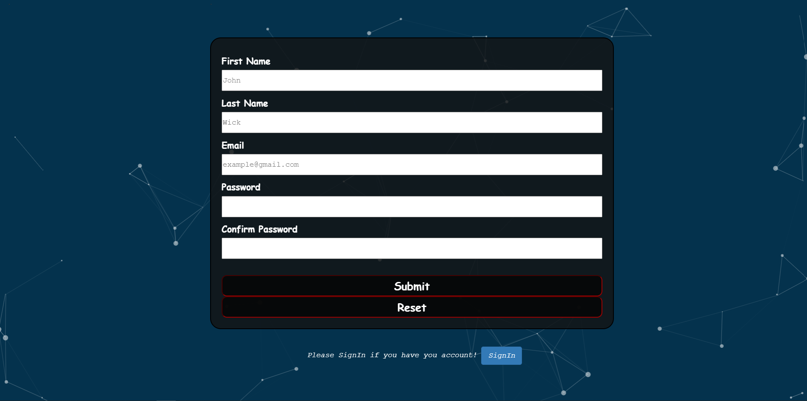
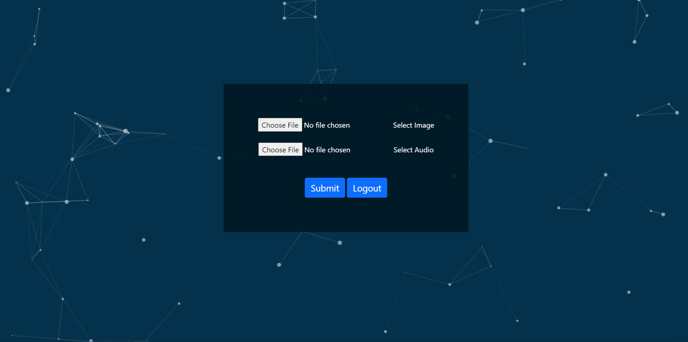

# Deepfakes-for-Video-Conferencing-Using-General-Adversarial-Networks-GANs-and-Multilingual-Voice-Clonning
This repository contains a flask application which will Deepfakes on audio and Image given by the user
<h2>Technology Stack:</h2>
<ol>
  <li>Wav2lip </li>
  <li>SyncNet Discriminator</li>
  <li>Flask as a backend server</li>
  <li>Python</li>
  <li>MongoDB database</li>
  <li>HTML</li>
  <li>CSS</li>
  <li>Paricle JS</li>
</ol>

<h2> User Interface Snapshots </h2>
 

<h2> User Signup page </h2>
 

 

<h2> User Registration page </h2>
 

 

<h2> Upload Image and Audio to create DeepFake </h2>
 

 

<h2> Result </h2>
 

 

<h2>References<h2>
<ol>
  <li>
      Wav2Lip : https://arxiv.org/pdf/2003.00418.pdf
  </li>
  <li>
      SyncNet Discriminator : https://www.robots.ox.ac.uk/~vgg/publications/2016/Chung16a/chung16a.pdf
  </li>
  <li>
      LipGan : https://arxiv.org/pdf/2008.10010.pdf
  </li>
</ol>

<!--  

 

 -->
